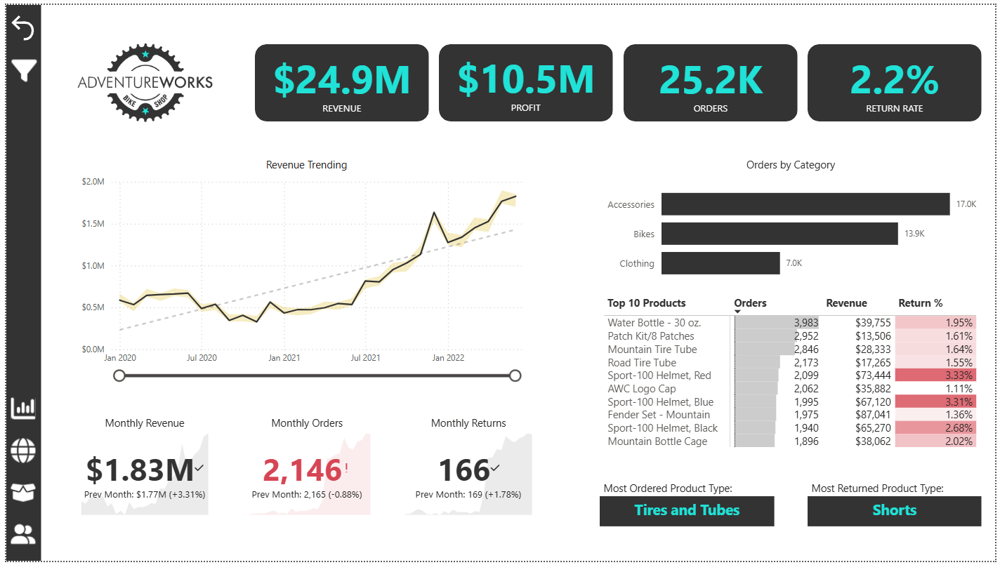
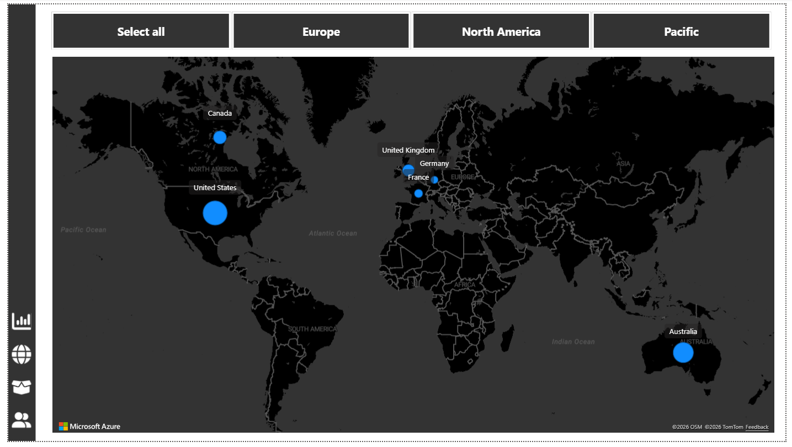
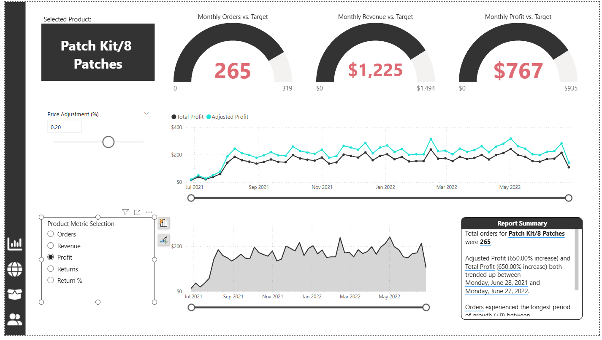
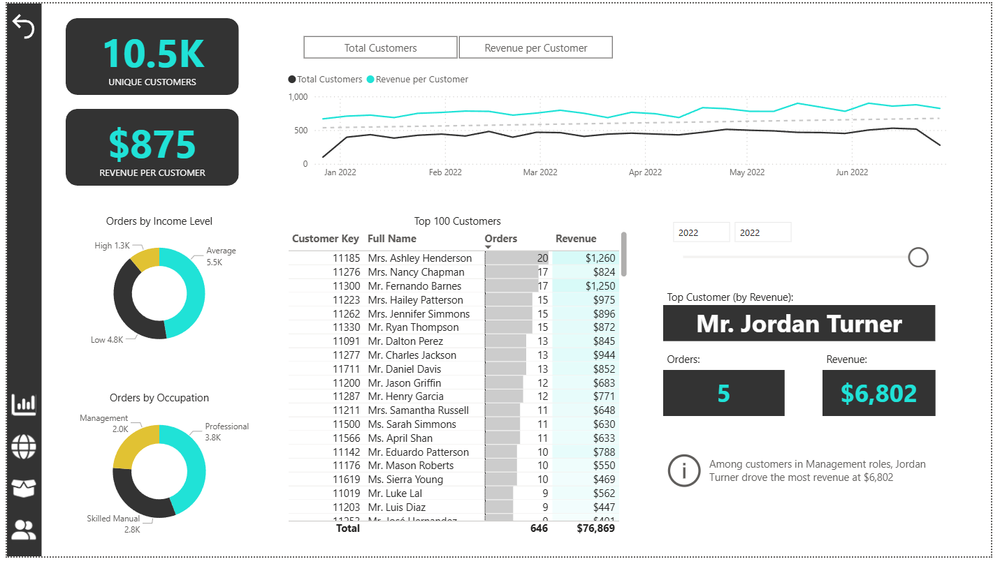

# 📊 Adventure Works Report (Power BI)

## 🧭 Project Overview

This project analyzes the sales performance of a bike shop over a 3-year span, with a detailed analysis of different products, the product categories they belong to, and sales across different regions using an interactive Power BI dashboard.

---

## 📚 Learning Context

This Power BI project was developed as part of the "Microsoft Power BI Desktop for Business Intelligence" course on Udemy.

The goal of the exercise was to practice:
- ETL processes
- data modeling
- building interactivity into dashboards

---

## 🖼️ Dashboard Preview

### Exec Dashboard



### Map



### Product Detail



### Customer Detail



---

## 🎯 Business Approach

Taking a look at the data from a business point of view, identifying the KPIs that are going to be used is an essential part of the project. The most important KPIs, which are displayed at the top of the main dashboard, are:

* Revenue
* Profit
* Orders
* Return Rate

This project also aims to answer key questions, such as:

* Which product is returned the most?
* Which regions generate the highest revenue?
* How does a possible price adjustment affect a product's profit?
* How do sales trend over time?
* Which customer drives the most revenue?

---

## 📁 Dataset Source

The dataset used in this project was provided in the course. It is based on the "Adventure Works" dataset, which is a free and publicly available dataset.

---

## 🧩 Data Model

A structured data model was implemented in Power BI to optimize analysis. The data model of this project consists of 2 smaller ones, since the dataset consists of 2 fact tables. The data models use the Star Schema approach.

Key components:

* Fact tables: **Sales Data**, **Returns Data**
* Dimension tables (Lookup tables):

  * Territory
  * Calendar
  * Product
  * Customer
  * Product Subcategories
  * Product Categories

Relationships between the fact and dimension tables were created, in order to support **time-based and categorical analysis**.

Through the data analysis, some extra tables have been created and added to the final data model, such as a **Measure Table** and a **Model Measures** table. The first one organizes all measures created in folders and the latter explains their expression with a brief description, respectively.

---

## 🧮 Key Measures (DAX)

Several calculated measures were created using DAX:

```DAX
Total Sales = SUM(Sales[Sales])

Total Profit = SUM(Sales[Profit])

Profit Margin = DIVIDE([Total Profit], [Total Sales])
```

These measures allow dynamic aggregation across filters and visuals.

---

## ✨ Dashboard Features

The interactive dashboard includes:

* 📈 **Sales trend analysis over time**
* 🌍 **Regional performance comparison**
* 📦 **Product category breakdown**
* 📊 **KPI indicators for sales and profit**
* 🎛️ **Interactive slicers and filters**

Users can dynamically explore data by:

* Region
* Product category
* Time period

---

## 🔍 Key Insights

Some insights identified from the analysis:

* Sales peak during **Q4**, indicating strong seasonal demand.
* The **West region consistently generates the highest revenue**.
* **Technology products contribute the largest share of profit**.
* Certain regions show **high revenue but relatively low profit margins**, suggesting pricing or cost issues.
