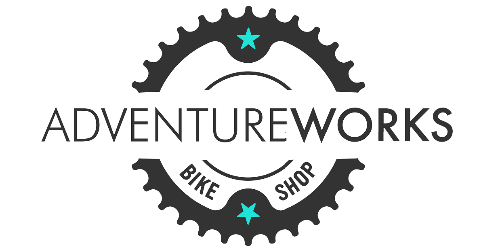

<p align="center">
  
</p>

# 📊 Adventure Works Report (Power BI)

## 🧭 Project Overview

This project analyzes the sales performance of a bike shop over a 3-year span, with a detailed analysis of different products, the product categories they belong to, and sales across different regions using an interactive Power BI dashboard.

It was developed as part of the "Microsoft Power BI Desktop for Business Intelligence" course on Udemy, provided by Maven Analytics, during Oct-Nov/2025.

---

## 📚 Learning Context

The goal of the project was to learn more about Power BI features, as well as to practice:
- ETL processes
- data modeling
- building interactivity into dashboards

---

## 🖼️ Dashboard Preview

### Exec Dashboard


### Map


### Product Detail


### Customer Detail


---

## 🎯 Business Approach

Taking a look at the data from a business point of view, this project also aims to answer key questions, such as:

* Which product is returned the most?
* Which regions generate the highest revenue?
* How does a possible price adjustment affect a product's profit?
* How do sales trend over time?
* Which customer drives the most revenue?

---

## 📁 Dataset Source

The dataset used in this project was provided in the course. It is based on the "Adventure Works" dataset, which is a free and publicly available dataset.

---

## 🧩 Data Model

A structured data model was implemented in Power BI to optimize analysis. The data model of this project consists of 2 smaller ones, since the dataset consists of 2 fact tables. The data models use the Star Schema approach.

Key components:

* Fact tables: **Sales Data**, **Returns Data**
* Dimension tables (Lookup tables):

  * Territory
  * Calendar
  * Product
  * Customer
  * Product Subcategories
  * Product Categories

Relationships between the fact and dimension tables were created, in order to support **time-based and categorical analysis**.

Over the course of the project some extra tables have been created, such as:
  * **Measure Table**: This table keeps all measures organized in folders, reducing the time it takes to look for a measure.
  * **Time Intelligence**: This calculation group simplifies the measure management of time intelligence- related measures, allowing for a scalable feature to facilitate its use in visuals.
  * **Measure Selector** and **Customer Metric Selection**: These selectors allow for a better UI/UX across visuals.

---

## 🧮 Key Measures (DAX)

Identifying KPIs that we can make the most out of this dataset is an essential part of the project. The most important KPIs, which are also displayed at the top of the main ("Exec") dashboard, are:

* Revenue
* Profit
* Orders
* Return Rate

Those KPIs were calculated using DAX functions in Power BI:

```DAX
Total Revenue = SUMX(
    'Sales Data',
    'Sales Data'[OrderQuantity] * RELATED('Product Lookup'[ProductPrice])
)

Total Profit = [Total Revenue] - [Total Cost]

Total Orders = DISTINCTCOUNT('Sales Data'[OrderNumber])

Return Rate = DIVIDE([Quantity Returned], [Quantity Sold], "No Sales")
```

These measures allow dynamic aggregation across filters and visuals.

---

## ✨ Dashboards Features

The dashboards include:

* **Revenue trend analysis over time**
* **Product category tooltip with key measures**
* **Product drill through option**
* **Regional performance comparison on orders**
* **Product price adjustment profit gain**
* **Interactive slicers and filters**
* **Left sidebar menu for easier navigation across the report**

---

## 🔍 Key Insights

Some insights identified from the analysis:

* The most ordered product type was **Tires and Tubes**, while the most returned **Shorts**.
* The **United States** has the most orders of all regions.
* **Customers with a high income make the least amount of orders**.
* **Among customers in management roles, mr. Jordan Turner drove the most revenue**.
